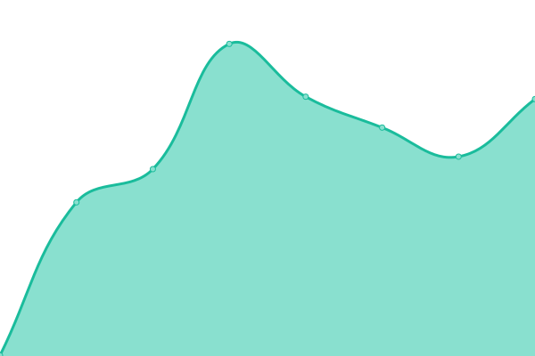
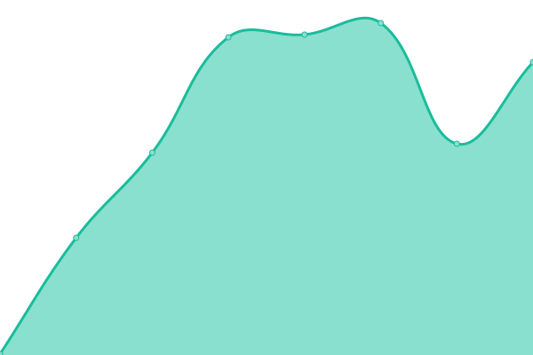
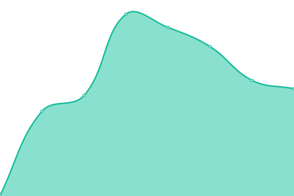
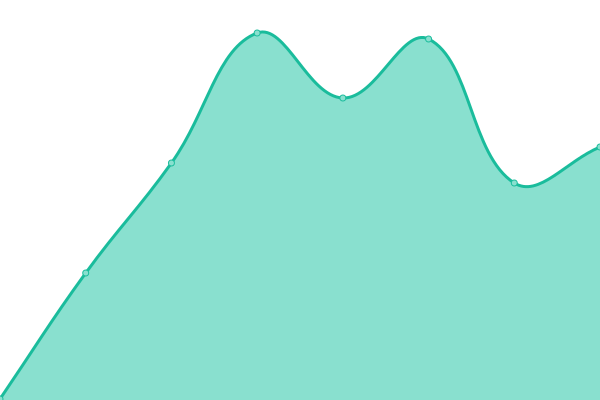

# [📈 Live Status](https://Neogoma.github.io/uptime): <!--live status--> **🟩 All systems operational**

This repository contains the open-source uptime monitor and status page for [Neogoma](neogoma.com), powered by [Upptime](https://github.com/upptime/upptime).

With [Upptime](https://upptime.js.org), you can get your own unlimited and free uptime monitor and status page, powered entirely by a GitHub repository. We use [Issues](https://github.com/Neogoma/uptime/issues) as incident reports, [Actions](https://github.com/Neogoma/uptime/actions) as uptime monitors, and [Pages](https://Neogoma.github.io/uptime) for the status page.

<!--start: status pages-->
<!-- This summary is generated by Upptime (https://github.com/upptime/upptime) -->
<!-- Do not edit this manually, your changes will be overwritten -->
<!-- prettier-ignore -->
| URL | Status | History | Response Time | Uptime |
| --- | ------ | ------- | ------------- | ------ |
|  [Neogoma Website](https://www.neogoma.com) | 🟩 Up | [neogoma-website.yml](https://github.com/Neogoma/uptime/commits/HEAD/history/neogoma-website.yml) | 

 323ms
     
 | 

<a href="https://status.neogoma.com/history/neogoma-website">100.00%</a>
    

|  [Stardust Dashboard](https://stardust.neogoma.com/current_version) | 🟩 Up | [stardust-dashboard.yml](https://github.com/Neogoma/uptime/commits/HEAD/history/stardust-dashboard.yml) | 

 225ms
     
 | 

<a href="https://status.neogoma.com/history/stardust-dashboard">100.00%</a>
    

|  [Stardust API](https://lothal.neogoma.com/api/current_version) | 🟩 Up | [stardust-api.yml](https://github.com/Neogoma/uptime/commits/HEAD/history/stardust-api.yml) | 

 220ms
     
 | 

<a href="https://status.neogoma.com/history/stardust-api">100.00%</a>
    

|  [Stardust relocation](https://dagobah.neogoma.com/api/current_version) | 🟩 Up | [stardust-relocation.yml](https://github.com/Neogoma/uptime/commits/HEAD/history/stardust-relocation.yml) | 

 197ms
     
 | 

<a href="https://status.neogoma.com/history/stardust-relocation">100.00%</a>
    

|  [Are4 API](https://api.are4.world/version) | 🟩 Up | [are4-api.yml](https://github.com/Neogoma/uptime/commits/HEAD/history/are4-api.yml) | 

 319ms
     
 | 

<a href="https://status.neogoma.com/history/are4-api">100.00%</a>
    

<!--end: status pages-->

[**Visit our status website →**](https://Neogoma.github.io/uptime)

## 📄 License

- Powered by: [Upptime](https://github.com/upptime/upptime)
- Code: [MIT](./LICENSE) © [Neogoma](neogoma.com)
- Data in the `./history` directory: [Open Database License](https://opendatacommons.org/licenses/odbl/1-0/)
